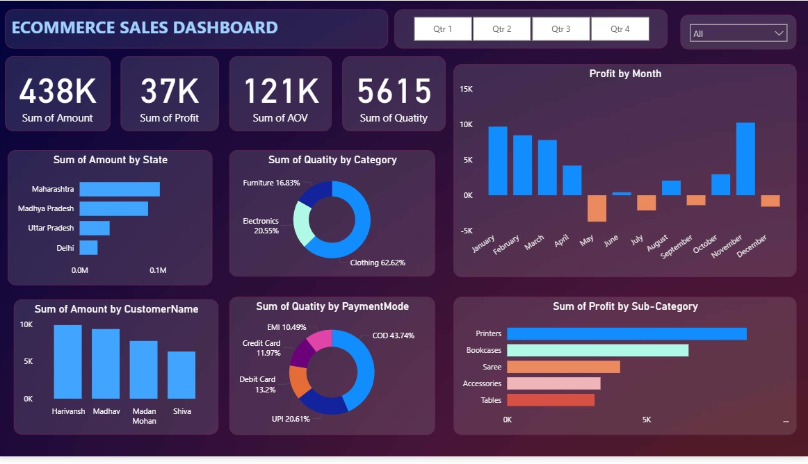
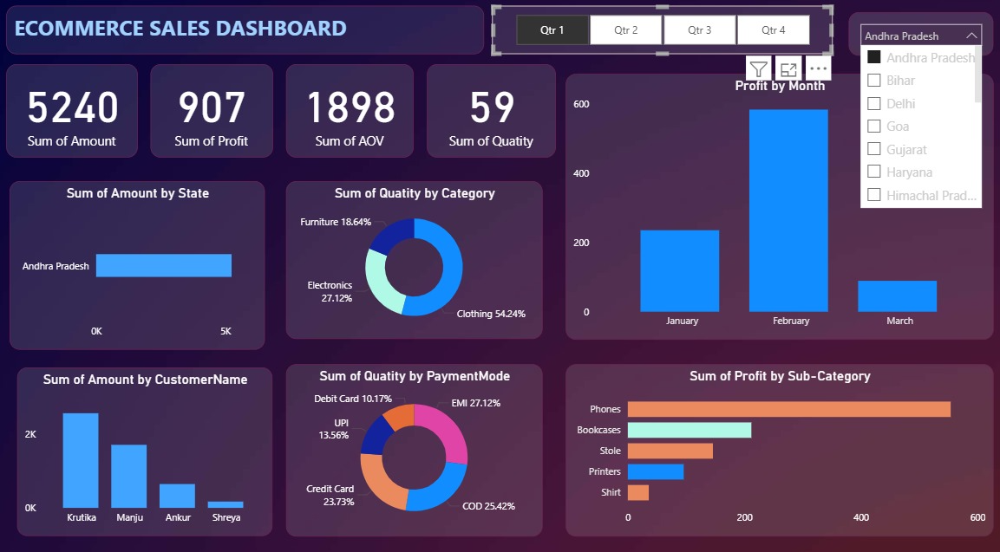

# 📊 E-commerce Sales Dashboard (Power BI)

## 📌 Overview  
This repository contains an **E-commerce Sales Dashboard** developed in Power BI. The dashboard provides a comprehensive view of online sales performance, enabling businesses to track revenue, profit, customer behavior, and product performance through interactive visualizations.

---

## ✨ Features  
- **Key Metrics Overview** – Total Sales, Profit, Average Order Value (AOV), and Quantity  
- **Regional Insights** – Sales by State to identify top-performing regions  
- **Customer Analysis** – Track high-value customers and their contribution  
- **Category & Sub-Category Performance** – Identify best-selling and least-performing products  
- **Payment Mode Analysis** – Understand customer preferences across COD, UPI, Cards, EMI, etc.  
- **Profit Trends by Month** – Seasonal sales and profit variations  
- **Interactive Filters** – Slice data by **Quarter** and **State** for deep insights  

---

## 🛠️ Tools Used  
- **Power BI Desktop** – Data visualization and dashboard creation  
- **Excel / CSV Data Source** – Input sales dataset  
- **DAX** – For calculated measures and KPIs  

---

## 📷 Dashboard Screenshots  

### Dashboard View 1  

### Dashboard View 2  


---

## 🚀 How to Use  
1. Clone this repository:  
   ```bash
   git clone https://github.com/your-username/ecommerce-sales-dashboard.git
   ```
2. Open the `.pbix` file using **Power BI Desktop**.  
3. Connect to the provided dataset or replace it with your own sales data.  
4. Explore insights with interactive filters and visualizations.  

---

## 📈 Insights Gained  
- Maharashtra, Madhya Pradesh, and Uttar Pradesh lead in overall sales.  
- Clothing contributes the highest sales volume among categories.  
- COD is the most preferred payment mode.  
- Printers and Bookcases show strong profitability, while some sub-categories underperform.  
- Seasonal variations affect profitability, with notable peaks in **January, February, and December**.  

---

## 📌 Future Enhancements  
- Integration with live databases for real-time updates  
- Adding customer segmentation and churn analysis  
- Forecasting future sales using AI/ML models  

---

